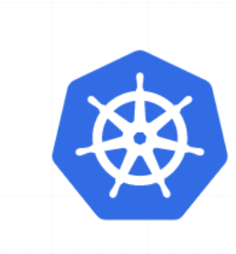

## kubernetes (k8s)


#### Manual steps to install kubernetes
* Create 3 vms and login
* consider 1vm as master and remaining as nodes
---Steps to be done in all the vms---
1. Install DOCKER in all vms

* `curl -fsSL https://get.docker.com -o install-docker.sh`
* `sh install-docker.sh` 
   * `now docker info` ( unix:///var/run/cri-dockered.sock)
   * now check docker version -server version will be denied.
    * `docker version` 
* add ubuntu user to docker group
 * `sudo usermod -aG docker ubuntu`
 * logout & login
  * `logut`
2. To install CRI-docker and get the latest releases  

  * wget https://github.com/Mirantis/cri-dockerd/releases/download/v0.3.4/ cri-dockerd_0.3.4.3-0.ubuntu-jammy_amd64.deb
    * sudo dpkg -i cri-dockerd_0.3.4.3-0.ubuntu-jammy_amd64.deb (### dabean package )  
3. Insatall kubeadm, kubectl & kubelet on all "Vms" 

* Update the apt package index and install packages needed to use the Kubernetes apt repository:

 * `sudo apt-get update`
#### apt-transport-https may be a dummy package; if so, you can skip that package

 * `sudo apt-get install -y apt-transport-https ca-certificates curl`
* Download the public signing key for the Kubernetes package repositories. The same signing key is used for all repositories so you can disregard the version in the URL:
 * `curl -fsSL https://pkgs.k8s.io/core:/stable:/v1.28/deb/Release.key | sudo gpg --dearmor -o /etc/apt/keyrings/kubernetes-apt-keyring.gpg`

* Add the appropriate Kubernetes apt repository:

#### This overwrites any existing configuration in /etc/apt/sources.list.d/kubernetes.list
 * ` echo 'deb [signed-by=/etc/apt/keyrings/kubernetes-apt-keyring.gpg] https://pkgs.k8s.io/core:/stable:/v1.28/deb/ /' | sudo tee /etc/apt/sources.list.d/kubernetes.list`

 * Update the apt package index,install kubelet,kubeadm and kubectl, and pin their version:
  
  *  sudo apt-get update
   • `sudo apt-get install -y kubelet kubeadm kubectl`
   • `sudo apt-mark hold kubelet kubeadm kubectl`

#### ---Execute the following on master node---
4. Now lets create a k8s cluster using kubeadm

5. Lets initialize the cluster using the following command as a root user

   * `sudo -i`
   * `kubeadm init --pod-network-cidr "10.244.0.0/16" --cri-socket "unix:///var/run/cri-dockerd.sock"`
6. On the master node to run kubectl as regular user execute the following

    ```
   mkdir -p $HOME/.kube
   sudo cp -i /etc/kubernetes/admin.conf $HOME/.kube/config
   sudo chown $(id -u):$(id -g) $HOME/.kube/config
   ```
7. Now as a regular user execute kubectl get nodes
 * `kubectl get nodes`

 #### ---Execute the command in worker node---
 
8. Now as a root user in workernode execute the join command

####  we will get after initialise step
 * ` kubeadm join 172.31.13.69:6443 --token t0hkv6.es6qexws9lhbbi5x \ --discovery-token-ca-cert-hash sha256:d80f37bfb0dc701380dc1fb816cda39b91e84b841b3263d954c141507ae6929a \ --cri-socket "unix:///var/run/cri-dockerd.sock"`

#### ---execute in master node---

9. Now execute kubectl get nodes from master node
 * `kubectl get nodes`

10. Now kuberentes needs CNI plugin so that pod-network is enabled. Till this is done the DNS doesnot work, services don't work so nodes are shown as NotReady.

11. We can choose among wide range of CNI plugins, For this lets use flannnel. Execute the following on master node
```
kubectl apply -f https://github.com/flannel-io/flannel/releases/latest/download/kube-flannel.yml
   ```

12. Now execute kubectl get nodes -w & wait for all the nodes to get to ready state 
```
kubectl get nodes -w` 
```
### PODS:-

* Pod is colletion of containers.
   * container in which we have application running is main and other as side.
   * Containers are in inside the "Pod"

#### Creating Pod Manifests

```
---
apiVersion:
kind:
metadata:
spec:
```
* This when execute becomes 5 as ka8s will add status

```
---
apiVersion:
kind:
metadata:
spec:
status:
```
* --To fill apiVersion--
#### if the apiGroup is not core
apiVersion: <apiGroup>/<version>

#### if the apiGroup is core
apiVersion: <version>


* Metdata: This helps in naming and labelling resources in k8s
* Lets create a manifest to run nginx pod

```
---
apiVersion: v1
kind: Pod
metadata:
  name: hello-pods
spec:
  containers:
    - name: webserver
      image: nginx:1.25
```
* apply and execute the following commands


* When we execute kubectl get pod hello-pod -o yaml


### Additional info
 * Kubernetes allows us to view all the resources using kubectl

 * kubernetes allows us to create resources imperatively as well declaratively
* Imperative means constructing a command

kubectl run nginx --image nginx

* Declartive: Create a yaml file with below content and execute kubectl apply -f <filename.yaml> to create and kubectl delete -f <filename.yaml> to delete
```
---
apiVersion: v1
kind: Pod
metadata:
  name: nginx
spec:
  containers:
  - name: nginx
    image: nginx:1.14.2
    ports:
    - containerPort: 80
```


### Pods Contd
Scaling: Scaling in k8s means increasing number of Pods not containers in Pod. For Scaling pods we would learn Replica set/Replication Controller etcs..
 * How k8s identifies objects: Labels
 * Label is a key pair examples are
   * app: nginx
   * version: v1.0


* Labels are used to select/query kubernetes objects
* Selectors in k8s help in querying objects using labels
 * selectors are of two types
   * Equality Based Selectors
   * Set based selectors

 ## Pods with labels 
*  Create pods
```
---
apiVersion: v1
kind: Pod
metadata:
  name: nginx-pod-labels1
  labels:
    app: nginx
    env: dev
    release: v1.1
spec:
  containers:
    - name: webserver
      image: nginx:1.25
      ports: 
        - containerPort: 80
          protocol: TCP
---
apiVersion: v1
kind: Pod
metadata:
  name: nginx-pod-labels2
  labels:
    app: nginx
    env: qa
    release: v1.1
spec:
  containers:
    - name: webserver
      image: nginx:1.25
      ports: 
        - containerPort: 80
          protocol: TCP
---
apiVersion: v1
kind: Pod
metadata:
  name: nginx-pod-labels3
  labels:
    app: nginx
    env: uat
    release: v1.1
spec:
  containers:
    - name: webserver
      image: nginx:1.25
      ports: 
        - containerPort: 80
          protocol: TCP
```          

* writing manifest to empty

* vi patient.yaml

---
apiVersion: v1
kind: 	Pod
metadata:
  name: empty
  labels:
   app: nothing
spec:
  containers:
    - name: empty
      image: alpine 

* At first it goes to pending state. Pending state nothing but in k8s is "API server" accepted your request and stored in
"etcd cluster" 
* sheduler pickedup your stuf and than its trying to sheduling in your node. Once it shedule bacically it will create container there.
* Container is created unfortunatilly it will go to "completed" state.
* K8s tries to recreate the node
* K8s always try to recreate the containers inside the pod.

#### Controllers

* Pod tries to keep container running, but for us we need to keep "PODs". According to some state, It has two state 
   1.Replicas
   2.Jobs
* Replicas:
    * Here we have two resources ReplicationController, Replicatset.
    * Here desired state (spec)
    * number of replicas
    * Pod spec
    * labes selector
* These objects try to maintain the desired state.
* job:-
    * These wil run the pod when we need.
    * Here we have two resources
       * Job
       * Cronjob

    * jobs will run the pod certain time when we want.  
    * Cronjob is nothing but sheduling, if we want to run the pod every 5 mints or 1day or ect... just we have to shedule the time.
  * These are all pod specifications, and how its knows the pod specifications match by labels. First its matchs the labels.


  ### ReplicaSet
   * This Resource is responsible for maintaing the desired state of number of replicase of pod
   * Replicaset tells about 3 important things
      1. how many replicas we want.sec:-replicas
      2. how can measure there are running or not sec:-selector
      3. what do we mean the create the repicas of sec:-templates
      


### Activity
 * Create a replica set with 3 replicas of jenkins/jenkins
